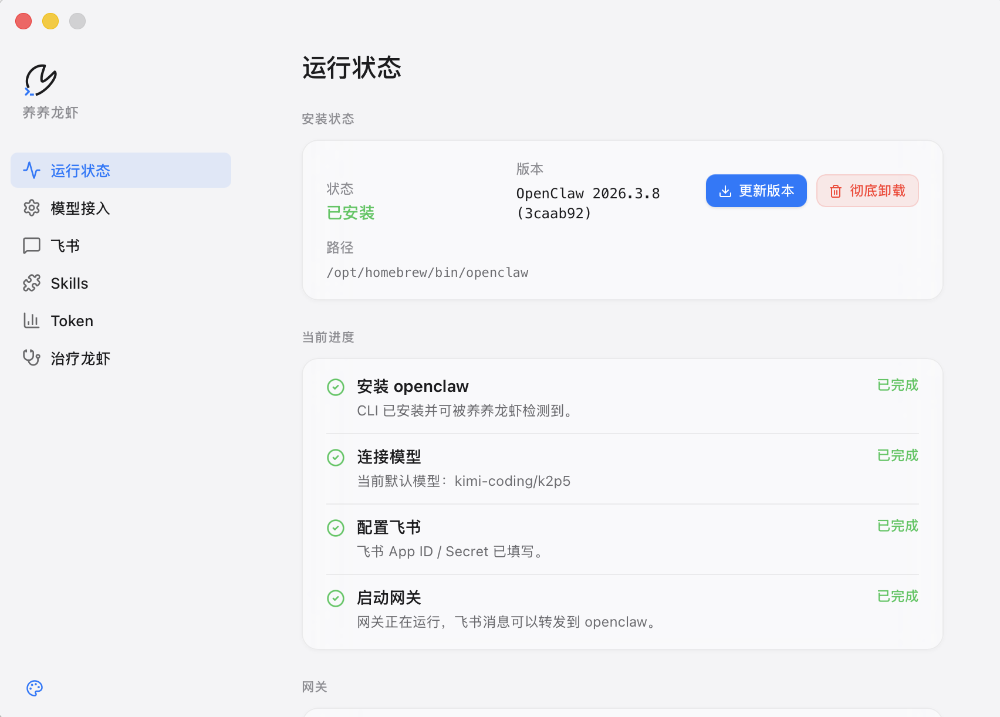

# ClawB Desktop

ClawB Desktop，面向 `OpenClaw` 的跨平台桌面控制台（支持 Windows / macOS）。



## ✨ 功能特性

### 环境管理
- 一键安装、更新、卸载 `openclaw`
- Node.js 环境自动检测
- Gateway 网关服务管理（启动/停止/重启）

### 消息渠道
- 支持多种消息渠道：**微信**、**飞书**、**Telegram**、**Discord**、**钉钉**、**QQ**
- 微信扫码绑定，即插即用
- 统一消息发送架构

### Skills 管理
- 安装、卸载、查看 Skills
- Skills 市场浏览

### 运维监控
- Token 趋势与模型调用统计
- 常见问题诊断与修复

## 🚀 安装方式

### 方式一：直接下载安装包

安装包位于 GitHub Releases 页面：

- https://github.com/xbrooke/ClawB/releases

下载对应平台的安装包即可。

### 方式二：一条命令安装

```bash
./install.sh /path/to/ClawB.app.zip
```

## 👀 适用对象

- 希望通过桌面客户端管理 OpenClaw 的用户
- 需要配置多个消息推送渠道的开发者
- 需要可视化运维工具的团队

## 📋 系统要求

- Windows 10+ 或 macOS 10.15+
- Node.js 18+（用于扩展功能）

## � 技术栈

- **前端**：React + TypeScript + Vite
- **桌面**：Tauri 2.x
- **后端**：Rust
